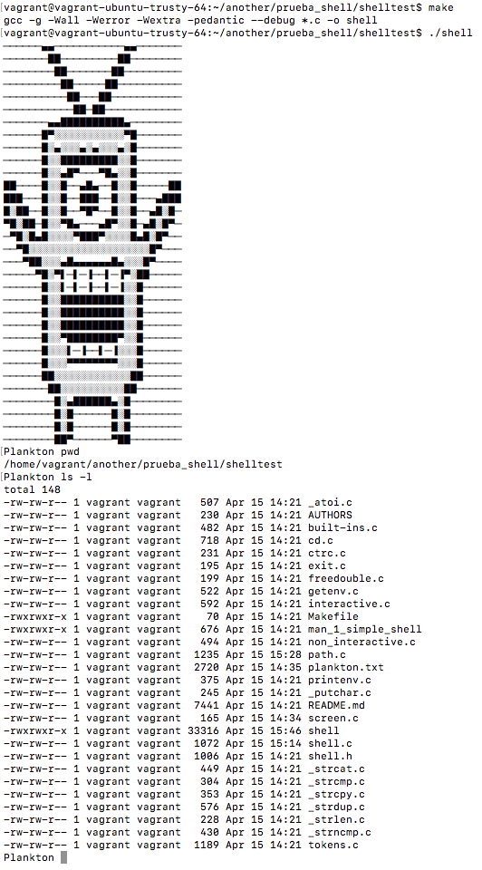
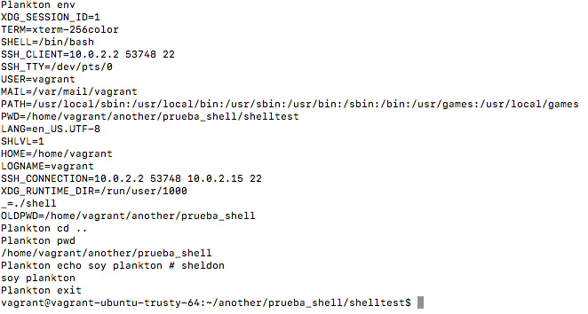

# Planknkton - shell
### Plankton — shell, the standard command language interpreter


This repository has the files and code in order to run a manage a simple shell and execute commands from the command line string.

## Getting Started
In order to dowload the program and runs the Plankton shell, it is necesary to copy the repository in your computer using the:
```
git clone <url>
```
To execute the program it is important to run the Makefile, it is going to compilate the all .c files in this way:
```
gcc -g -Wall -Werror -Wextra -pedantic --debug *.c -o shell
```
That is all, let´s get into the Plankton Shell!!

## Functions files of the program

```
FUNCTION FILE               DESCRIPTION

shell.c                     This is the main of the function - Plankton shell.
shell.h                     This is the file conteins the prototypes functions files #include "shell.h" and the other libraries.
built_ins                   It is call if the user digits a built in command: exit, env or cd.
cd.c                        Executes if the user type a cd command, directory change.
ctrlc.c                     It is calls is the user digits CTRLC, so it do not let finished excecution.
exit.c                      This function exits the program.
getenv.c                    This function gets the enviroment of the commands.
interactive.c               To create a song process in order to execute the command, taking the array of tokens and the searched path.
non-interactive.c           To create a song process to execute it in a non interactive way, taking the array of tokens, we already got the path.
path.c                      To get the all path and save it in a string without a delimitador
printenv.c                  To print in the prompt the enviorement of the variable.
tokens.c                    To get the tokens of the arguments and keep it in a grill.
_atoi                       Converts a array to an integer.
_memset.c                   Copy the character b to the fist n characters of n.
_putchar.c                  Writes the character c to stdout
_strcat.c                   Appends (anexa) the src string to the dest string
_strcmp.c                   Compares only the bytes of s1 & s2.
_strcpy.c                   Copies the src, including '\0', to the buffer pointed to dest.
_strdup.c                   Duplicate the string str using the head memory, wirth malloc.
_strlen.c                   This function counts the leng of a string.
_strncmp.c                  Compares only the first n bytes of s1 & s2.
```

## In order to understand & Running the program

### SYNOPSIS
       sh [-acefhikmnprstuvx] [arg] ...
       jsh [-acefhikmnprstuvx] [arg] ...

### DESCRIPTION
       The shell utility is a command language interpreter that shall execute commands read from a command line string, the standard input, or a specified file.

       Plakton Sh is a command programming language that executes commands read from a terminal or a file. See the invocation section for the meaning of arguments to the shell.

### ENVIRONMENT

### SIGNALS
The CRTLC CRTLD are the signals that presents:
          CRTLC staying in the execution of the program.
          CRTLD quits the execution of the prgram.

### COMMANDS
The shell interprets the words it reads according to a language.

### SEARCH & EXECUTION
There are three types of commands: shell functions, built-in commands, and normal programs. The command is searched for (by name) in that order. The three types of commands are all executed in a different way.

### PATH SEARCH
When locating a command, the shell first looks to see if it has a shell function by that name.
Then it looks for a built-in command by that name.  If a built-in command is not found, one of two things happen:

1. Command names containing a slash are simply executed without performing any searches.
2. The shell searches each entry in the PATH variable in	turn for the command.  The value of the PATH variable should be a series of entries separated by colons.	Each entry consists of a directory name. The current directory may be indicated	implicitly by an empty directory name, or explicitly by a single period.

### COMMANDS
The following commands could be managed in these program when it is running, as well as, Plankton could execute the commmands in a interactive and a non interactive (we do not need to call the search Path function, already got it) way:
```
echo[arg...]    Each arg is printed to standard output; afterwards, a newline is printed.
pwd   	        Prints the name of the current directory.
touch
mkdir
mk
mv
```

#### BUILT-INS:
```
exit            Causes the shell to exit with the exit.
env             Prints the enviroment.
cd[arg]         Change the current directory to arg. The shell parameter $HOME is the default arg.
If no directory arg is found and the $CDPATH parameter contains a list of directories separated by colons, each of these directories is used as a prefix to arg in the given order, and the current directory is set to the first one that is found.
```
#### EXAMPLES

##### cd command

The 'cd' commnad let us change the current directory.
```
Plankton cd [directory_name]
Plankton cd dir_1/dir_2/dir_3
```
##### pwd command

The 'pwd' command let us know the completly current library direction.
To print it use syntax:
```
Plankton pwd
```
##### echo command

The 'echo' command prints a string directly in the console.
To print a string use syntax:
```
Plankton echo "Hey, I am a Plankton shell"
```
##### rm command

The 'rm' command removes files from the system without confirmation.
To remove a file use syntax:
```
Plankton rm [filename]
```
### How it looks like in Plankton shell - Examples





### GLOSARY & IMPORTANT DEFINITIONS

#### POSIX
A family of open system standards based on Unix. Bash is primarily concerned with the Shell and Utilities portion of the POSIX 1003.1 standard.

#### Blank
A space or tab character.

#### Builtin
A command that is implemented internally by the shell itself, rather than by an executableprogram somewhere in the file system.

#### Control operator
A token that performs a control function. It is a newline or one of the following: ‘||’, ‘&&’, ‘&’, ‘;’, ‘;;’, ‘;&’, ‘;;&’, ‘|’, ‘|&’, ‘(’, or ‘)’.

#### Exit status
The value returned by a command to its caller. The value is restricted to eight bits, so the maximum value is 255.

#### Field
A unit of text that is the result of one of the shell expansions. After expansion, when executing a command, the resulting fields are used as the command name and arguments.

#### Filename
A string of characters used to identify a file.

#### Return status
A synonym for exit status.

#### Signal
A mechanism by which a process may be notified by the kernel of an event occurring in the system.

#### Special builtin
A shell builtin command that has been classified as special by the POSIX standard.

#### Token
A sequence of characters considered a single unit by the shell. It is either a word or an operator.

## Built With
* C program - The code source.

## Authors
* **Diego Castellanos** - [Diegokernel]
(https://github.com/Diegokernel)
* **Maria Alejandra Coy** - [macoyulloa]
(https://github.com/macoyulloa)
Please read [AUTHORS]
(https://github.com/macoyulloa/prueba_shell/blob/master/shelltest/AUTHORS) or details on our code of conduct, and the process for submitting pull requests to us.Plankton - shell
### Plankton — shell, the standard command language interpreter


This repository has the files and code in order to run a manage a simple shell and execute commands from the command line string.

## Getting Started
In order to dowload the program and runs the Plankton shell, it is necesary to copy the repository in your computer using the:
```
git clone <url>
```
To execute the program it is important to run the Makefile, it is going to compilate the all .c files in this way:
```
gcc -g -Wall -Werror -Wextra -pedantic --debug *.c -o shell
```
That is all, let´s get into the Plankton Shell!!

## Functions files of the program

```
FUNCTION FILE               DESCRIPTION

shell.c                     This is the main of the function - Plankton shell.
shell.h                     This is the file conteins the prototypes functions files #include "shell.h" and the other libraries.
built_ins                   It is call if the user digits a built in command: exit, env or cd.
cd.c                        Executes if the user type a cd command, directory change.
ctrlc.c                     It is calls is the user digits CTRLC, so it do not let finished excecution.
exit.c                      This function exits the program.
getenv.c                    This function gets the enviroment of the commands.
interactive.c               To create a song process in order to execute the command, taking the array of tokens and the searched path.
non-interactive.c           To create a song process to execute it in a non interactive way, taking the array of tokens, we already got the path.
path.c                      To get the all path and save it in a string without a delimitador.
printenv.c                  To print in the prompt the enviorement of the variable.
tokens.c                    To get the tokens of the arguments and keep it in a grill.
_atoi                       Converts a array to an integer.
_memset.c                   Copy the character b to the fist n characters of n.
_putchar.c                  Writes the character c to stdout
_strcat.c                   Appends (anexa) the src string to the dest string.
_strcmp.c                   Compares only the bytes of s1 & s2.
_strcpy.c                   Copies the src, including '\0', to the buffer pointed to dest.
_strdup.c                   Duplicate the string str using the head memory, wirth malloc.
_strlen.c                   This function counts the leng of a string.
_strncmp.c                  Compares only the first n bytes of s1 & s2.
```

## In order to understand & Running the program

### SYNOPSIS
       sh [-acefhikmnprstuvx] [arg] ...
       jsh [-acefhikmnprstuvx] [arg] ...

### DESCRIPTION
       The shell utility is a command language interpreter that shall execute commands read from a command line string, the standard input, or a specified file.

       Plakton Sh is a command programming language that executes commands read or a file. See the invocation section for the meaning of arguments to the shell.

### ENVIRONMENT

### SIGNALS
The CRTLC CRTLD are the signals that presents:
          CRTLC staying in the execution of the program.
          CRTLD quits the execution of the prgram.

### COMMANDS
The shell interprets the words it reads according to a language.

### SEARCH & EXECUTION
There are three types of commands:	shell functions, built-in commands, and normal	programs.
The command is searched for (by name) in that order. The three types of commands are all executed in a different way.

### PATH SEARCH
When locating a command, the shell	first looks to see if it has a shell function by that name.
Then it looks for a built-in command by that name.  If a built-in command is not found, one of two things happen:

1. Command names	containing a slash are simply executed without performing any searches.
2. The shell searches each entry	in the PATH variable in	turn for the command.  The	value of the PATH variable should be a series of entries separated by colons.	Each entry consists of a directory name. The current directory may be indicated	implicitly by an empty directory name, or explicitly by a single period.

### COMMANDS
The following commands could be managed in these program when it is running, as well as, Plankton could execute the commmands in a interactive and a non interactive (we do not need to call the search Path function, already got it) way:
```
echo[arg...]    Each arg is printed to standard output; afterwards, a newline is printed.
pwd   	        Prints the name of the current directory.
touch
mkdir
mk
mv
```

#### BUILT-INS:
```
exit            Causes the shell to exit with the exit.
env             Prints the enviroment.
cd[arg]         Change the current directory to arg. The shell parameter $HOME is the default arg.
If no directory arg is found and the $CDPATH parameter contains a list of directories separated by colons, each of these directories is used as a prefix to arg in the given order, and the current directory is set to the first one that is found.
```
#### EXAMPLES

##### cd command

The 'cd' commnad let us change the current directory.
```
Plankton cd [directory_name]
Plankton cd dir_1/dir_2/dir_3
```
##### pwd command

The 'pwd' command let us know the completly current library direction.
To print it use syntax:
```
Plankton pwd
```
##### echo command

The 'echo' command prints a string directly in the console.
To print a string use syntax:
```
Plankton echo "Hey, I am a Plankton shell"
```
##### rm command

The 'rm' command removes files from the system without confirmation.
To remove a file use syntax:
```
Plankton rm [filename]
```
### How it looks like in Plankton shell - Examples


### GLOSARY & IMPORTANT DEFINITIONS

#### POSIX
A family of open system standards based on Unix. Bash is primarily concerned with the Shell and Utilities portion of the POSIX 1003.1 standard.

#### Blank
A space or tab character.

#### Builtin
A command that is implemented internally by the shell itself, rather than by an executableprogram somewhere in the file system.

#### Control operator
A token that performs a control function. It is a newline or one of the following: ‘||’, ‘&&’, ‘&’, ‘;’, ‘;;’, ‘;&’, ‘;;&’, ‘|’, ‘|&’, ‘(’, or ‘)’.

#### Exit status
The value returned by a command to its caller. The value is restricted to eight bits, so the maximum value is 255.

#### Field
A unit of text that is the result of one of the shell expansions. After expansion, when executing a command, the resulting fields are used as the command name and arguments.

#### Filename
A string of characters used to identify a file.

#### Return status
A synonym for exit status.

#### Signal
A mechanism by which a process may be notified by the kernel of an event occurring in the system.

#### Special builtin
A shell builtin command that has been classified as special by the POSIX standard.

#### Token
A sequence of characters considered a single unit by the shell. It is either a word or an operator.

## Built With
* C program - The code source.

## Authors
* **Diego Castellanos** - [Diegokernel]
(https://github.com/Diegokernel)
* **Maria Alejandra Coy** - [macoyulloa]
(https://github.com/macoyulloa)
Please read [AUTHORS]
(https://github.com/macoyulloa/prueba_shell/blob/master/shelltest/AUTHORS) or details on our code of conduct, and the process for submitting pull requests to us.
